# awesome-image-augmentation

## 目录

- 热门项目
- 相关论文
- 标注工具

- [Popular Projects](#Popular-Projects)
  - [imgaug](#imgaug)
  - [Albumentations](#Albumentations)
  - [Augmentor](#Augmentor)
- [Papers&Codes](#Papers&Codes)
  - [Cutout](#Cutout)
  - [CycleGAN](#CycleGAN)
  - [Small Object Augmentation](#Small-Object-Augmentation)
  - [Hard Example Mining](#Hard-Example-Mining)
  - [Mixup](#Mixup)
  - [CutMix](#CutMix)
  - [Fast Autoaugment](#Fast-Autoaugment)
  - [ISDA](#ISDA)
  - [AutoAugment](#AutoAugment)
  - [ImageCorruptions](#ImageCorruptions)
  - [InstaBoost](#InstaBoost)
  - [Augmix](#Augmix)
  - [Copy-Paste](#Copy-Paste)
  - [RandAugment](#RandAugment)
  - [Random Erasing](#Random-Erasing)
  - [GridMask](#GridMask)
  - [ALAE](#ALAE)
  - [Deep Image Harmonization](#Deep-Image-Harmonization)
  - [Segmentation & Matting](#Segmentation-&-Matting)
  - [MMD](#MMD)
- [Annotation Tools](#Annotation-Tools)
  - [LabelImg](#LabelImg)
  - [Labelme](#Labelme)

## Popular Projects

### imgaug

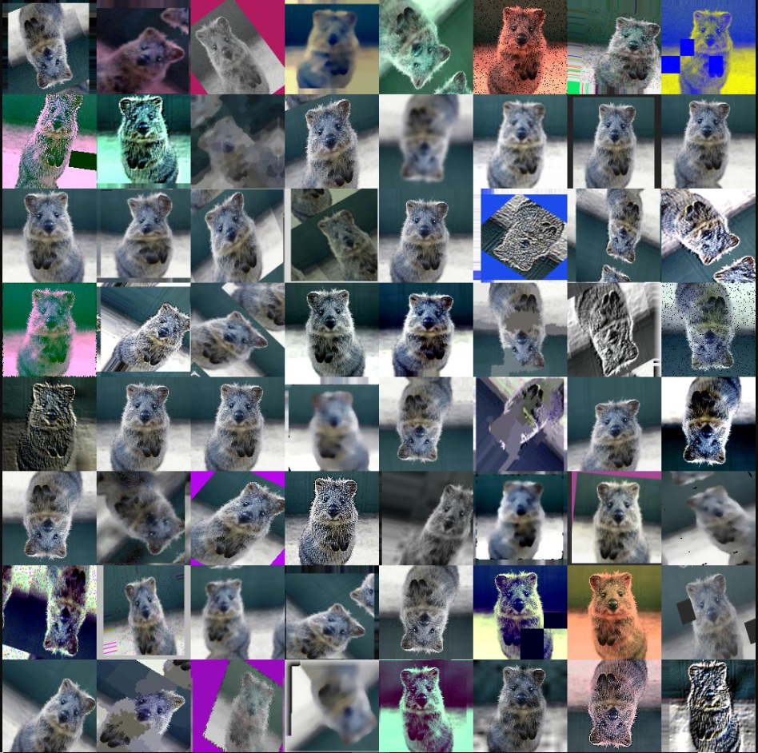

- intro: 2019
- github star: 7.8k
- github: <https://github.com/aleju/imgaug>

### Albumentations

**Albumentations: fast and flexible image augmentations**

- intro: ArXiv 2018
- github star: 4.1k
- arxiv: <https://arxiv.org/abs/1809.06839v1>
- github: <https://github.com/albumentations-team/albumentations>

### Augmentor

**Biomedical image augmentation using Augmentor**

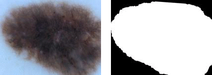

- intro: Bioinformatics
- github star: 3.7k
- github: <https://github.com/mdbloice/Augmentor>
- docs: <https://augmentor.readthedocs.io/en/master/>

Augmentor is a Python package designed to aid the augmentation and artificial generation of image data for machine learning tasks. It is primarily a data augmentation tool, but will also incorporate basic image pre-processing functionality.

## Papers&Codes

### Cutout

**Improved Regularization of Convolutional Neural Networks with Cutout**

- intro: arXiv 2017
- arxiv: <https://arxiv.org/abs/1708.04552>
- github: <https://github.com/uoguelph-mlrg/Cutout>

### CycleGAN

**Unpaired Image-to-Image Translation using Cycle-Consistent Adversarial Networkss**

- intro: ICCV 2017
- arxiv: <https://arxiv.org/pdf/1912.02781.pdf>
- provider: UC Berkeley
- github: <https://github.com/junyanz/pytorch-CycleGAN-and-pix2pix>
- github: <https://github.com/junyanz/CycleGAN>

### Small Object Augmentation

**Unpaired Image-to-Image Translation using Cycle-Consistent Adversarial Networkss**

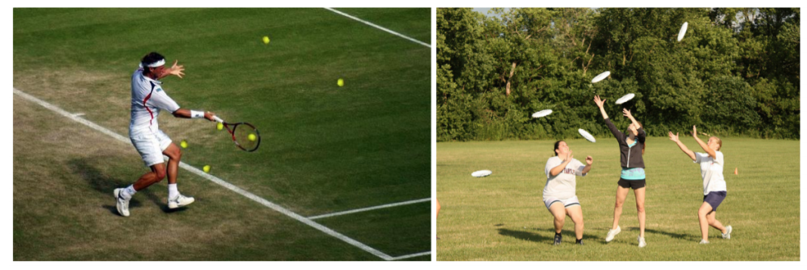

- intro:  2017
- arxiv: <https://arxiv.org/pdf/1902.07296.pdf>
- github: <https://github.com/gmayday1997/SmallObjectAugmentation>

### Hard Example Mining

**Unsupervised Hard Example Mining from Videos for Improved Object Detection**

- intro: ECCV 2018  
- arxiv: <http://vis-www.cs.umass.edu/unsupVideo/docs/unsup-video_eccv2018.pdf>
- github: <https://github.com/adiprasad/unsup-hard-negative-mining-mscoco>
- project: <http://vis-www.cs.umass.edu/unsupVideo/>
- demo video: <http://vis-www.cs.umass.edu/unsupVideo/docs/suppVideo.mp4>
- 知乎参考: <https://zhuanlan.zhihu.com/p/174057800>

### Mixup

**Mixup: BEYOND EMPIRICAL RISK MINIMIZATION**

- intro: ICLR2018
- arxiv: <https://arxiv.org/abs/1710.09412>
- github: <https://github.com/facebookresearch/mixup-cifar10>

Mixup is a generic and straightforward data augmentation principle. In essence, mixup trains a neural network on convex combinations of pairs of examples and their labels. By doing so, mixup regularizes the neural network to favor simple linear behavior in-between training examples.Cutmix

### CutMix

**CutMix:Regularization Strategy to Train Strong Classifiers with Localizable Features**

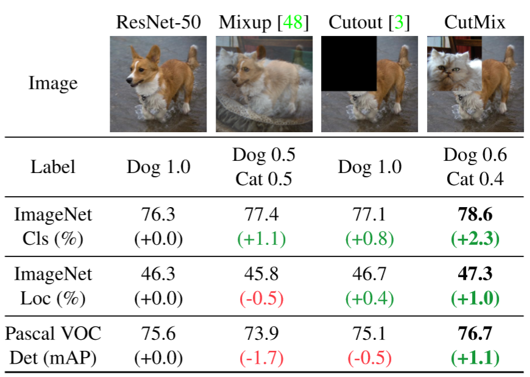

- intro: ICCV 2019 (oral talk)
- arxiv: <https://arxiv.org/pdf/1905.04899.pdf>
- github: <https://github.com/clovaai/CutMix-PyTorch>

### Fast Autoaugment

**Fast AutoAugment**

- intro: NeurIPS 2019 
- github star: 671
- arxiv: <https://arxiv.org/abs/1905.00397>
- github: <https://github.com/kakaobrain/fast-autoaugment>

### ISDA

- Intro: NeurIPS 2019
- github star: 564

- arxiv: https://arxiv.org/abs/1909.12220
- github: https://github.com/blackfeather-wang/ISDA-for-Deep-Networks

### AutoAugment

**AutoAugment:Learning Augmentation Strategies from Data**

- intro: CVPR 2019
- provider: google
- arxiv: <https://arxiv.org/pdf/1805.09501v3.pdf>
- github: <https://github.com/DeepVoltaire/AutoAugment>

### ImageCorruptions

**Benchmarking Robustness in Object Detection:Autonomous Driving when Winter is Coming**

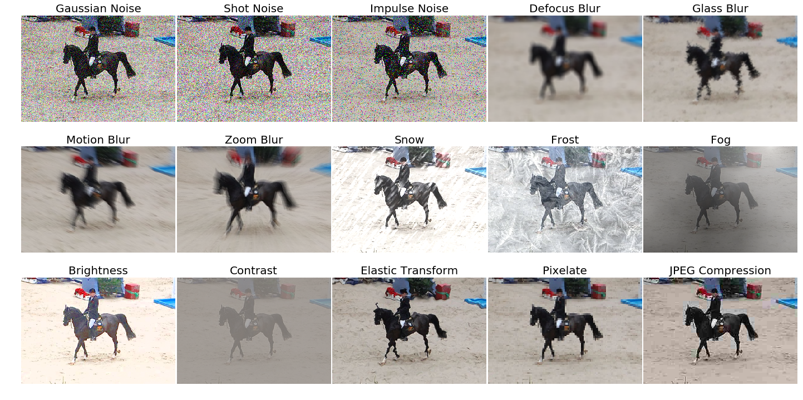

- intro: arXiv  2019
- arxiv: <https://arxiv.org/abs/1807.01697>
- github: <https://github.com/CrazyVertigo/imagecorruptions>

### InstaBoost

**InstaBoost: Boosting Instance Segmentation Via Probability Map Guided Copy-Pasting**

- intro: ICCV 2019  
- provider: SJTU
- arxiv: <https://arxiv.org/abs/1908.07801>
- github: <https://github.com/GothicAi/Instaboost>

### Augmix

**AUGMIX: A SIMPLE DATA PROCESSING METHOD TO IMPROVE ROBUSTNESS AND UNCERTAINTY**

- intro: ICLR 2020
- arxiv: <https://arxiv.org/pdf/1912.02781.pdf>
- github: <https://github.com/google-research/augmix>

### Copy-Paste

**Simple Copy-Paste is a Strong Data Augmentation Method for Instance Segmentation**

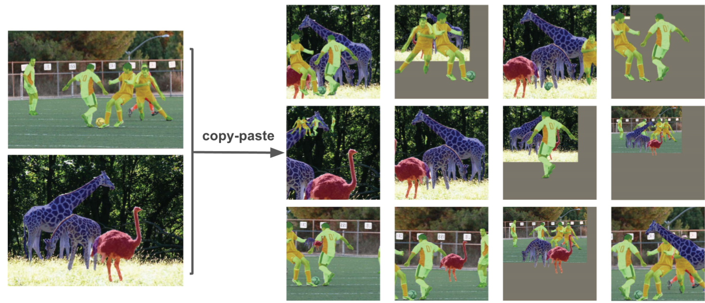

- intro: 2020
- provider: google
- arxiv: <https://arxiv.org/pdf/2012.07177.pdf>
- github: <https://github.com/google-research/augmix>AutoAugment

### RandAugment

**RandAugment: Practical automated data augmentation with a reduced search space**

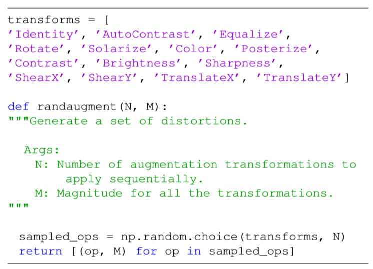

- intro: ICLR 2020
- provider: google
- arxiv: <https://arxiv.org/pdf/1909.13719.pdf>
- github: <https://github.com/tensorflow/tpu/tree/master/models/official/efficientnet>

### Random Erasing

**Random Erasing Data Augmentation**

| black  | white | random |
|----------------------------------------------------------------------------------------------------------------------------|--------------------------------------------------------------------------------------------------------------------------------------------------------|--------------------------------------------------------------------------------------------------------------------------------------------------------|
||| 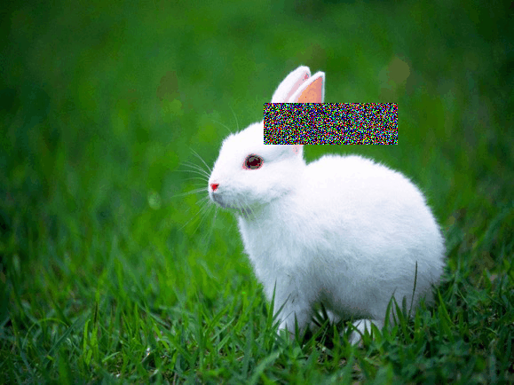|
|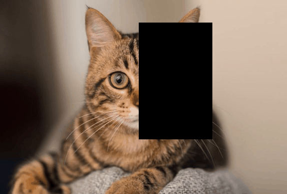|| 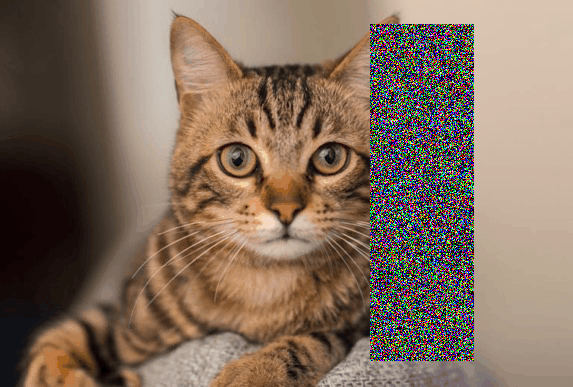|

- intro:  AAAI 2020
- arxiv: <https://arxiv.org/pdf/1708.04896.pdf>
- github: <https://github.com/zhunzhong07/Random-Erasing>

### GridMask

**Grid Mask Data Augmentation**

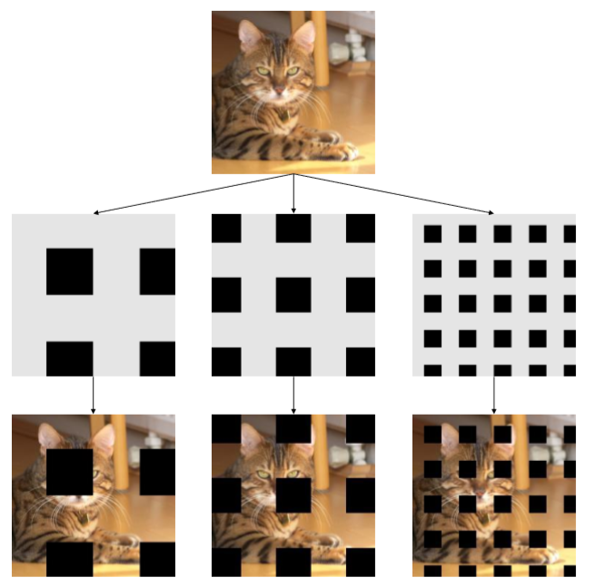

- intro:  2020.01
- arxiv: <https://arxiv.org/abs/2001.04086>
- github: <https://github.com/akuxcw/GridMask>
- 知乎参考: <https://zhuanlan.zhihu.com/p/103992528>

### ALAE

**Adversarial Latent Autoencoders**

- intro: CVPR 2020
- arxiv: <https://arxiv.org/pdf/2004.04467.pdf>
- github: <https://github.com/podgorskiy/ALAE>

### Deep Image Harmonization

**Deep Image Harmonization via Domain Verification**

- intro: CVPR 2020 
- provider: SJTU
- arxiv: <https://arxiv.org/abs/1911.13239>
- github: <https://github.com/bcmi/Image_Harmonization_Datasets>

### Segmentation & Matting

**Real-Time High-Resolution Background Matting**

- intro:  2020.12
- arxiv: <https://arxiv.org/abs/2012.07810>
- github: <https://github.com/PeterL1n/BackgroundMattingV2>

### MMD

**A Person Re-identification Data Augmentation Method with Adversarial Defense Effect**

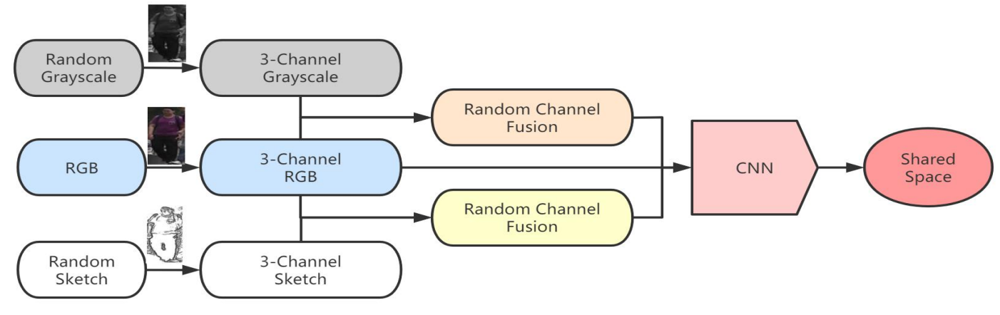

- intro:  2021.01
- arxiv: <https://arxiv.org/abs/2001.04086>
- github: <https://github.com/finger-monkey/ReID_Adversarial_Defense>

## 标注工具

| 工具名称 | 网址                                                         | 工具界面                                      |
| -------- | ------------------------------------------------------------ | --------------------------------------------- |
| LabelImg | [https://github.com/HumanSignal/labelImg](https://github.com/HumanSignal/labelImg) |  |
| LabelMe  | [https://github.com/labelmeai/labelme](https://github.com/labelmeai/labelme) |   |

